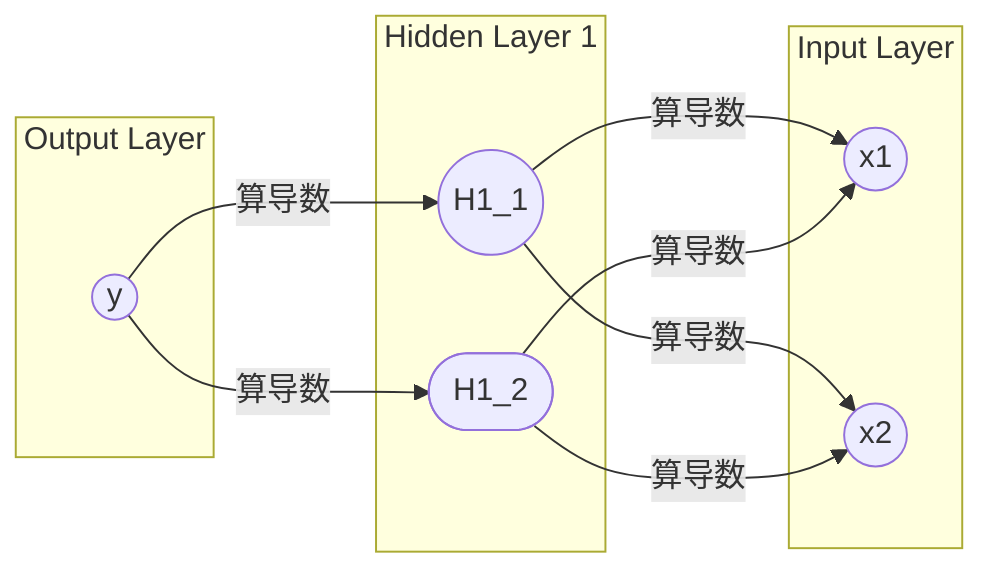
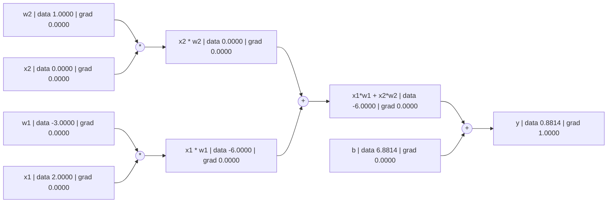

# 导数的作用

## 来源
- [[YT] The spelled-out intro to neural networks and backpropagation: building micrograd
](https://www.youtube.com/watch?v=VMj-3S1tku0&list=PLAqhIrjkxbuWI23v9cThsA9GvCAUhRvKZ)
- [micrograd](https://github.com/karpathy/micrograd)
- [bilibili中文字幕版本](https://www.bilibili.com/video/BV11yHXeuE9d/)

## 神经网络原理
你知道的，神经网络都是以下这样的结构。然后每个节点的计算公式都是 $\sum_{i=1}^{n} (w_nx_n)+b$

### 神经网络的正向传播
简单来说就是正常的接收2个输入 $x_1,x_2$，然后通过一大堆计算获得$y$
<!--不知道为什么需要用这种形式的mermai，才能在codeblock中正常使用mermaid-->

    subgraph Input Layer
        I1((x1))
        I2((x2))
    end

    subgraph Hidden Layer 1
        H1_1((H1_1))
        H1_2([H1_2])
    end

    subgraph Output Layer
        O1((y))
    end

    I1 --w1--> H1_1
    I1 --w2--> H1_2
    I2 --w3--> H1_1
    I2 --w4--> H1_2

    H1_1 --w5--> O1
    H1_2 --w6--> O1

<!-- more -->

### 神经网络的反向传播
当你正向传播计算完$y$后,它的结果并不一定准确。所以你需要通过更新$w_1,w_2,w_3...$之类的参数来使结果更准确。这是我们就需要通过反向传播一层一层的计算每个参数的导数来知道应该如何更新参数。

为了简单理解每个节点怎么算正向和反向传播，我们只看H1_1，H1_2的节点并把公式简约成
\begin{eqnarray\*}
y &=& H_1w_5 + H_2w_6 + b \\\\
  &=& x_1w_1 + x_2w_2 + b \\ (只是更改变量名字，x_1还是指代H_1只是改名字更直观而言，其它的也一样) \\\\
\end{eqnarray\*}

为了简单我们先不加上激活函数 $tanh()$ 所以最终的公式为 $ y = x_1w_1 + x_2w_2 + b$


## 正向传播图表
所以当正向传播后，我们的图表会变成这样，每个变量都有自己的数值


### 反向传播
现在我们可以开始开始反向传播了。首先第一步，我们先计算Y的导数，它的结果是1，它的推导可以参考以下下代码，该代码使用[这里的公式](https://en.wikipedia.org/wiki/Derivative#:~:text=A%20function%20of%20a%20real,%E2%81%A0%2C%20and%20the%20limit)
 $\displaystyle L=\lim _{h\to 0}{\frac {f(a+h)-f(a)}{h}}$

<details>
  <summary>导数推导</summary>

```python
def 求导():
  
  h = 0.001
  
  a = Value(2.0, label='a')
  b = Value(-3.0, label='b')
  c = Value(10.0, label='c')
  e = a*b; e.label = 'e'
  d = e + c; d.label = 'd'
  f = Value(-2.0, label='f')
  L = d * f; L.label = 'L'
  L1 = L.data
  
  a = Value(2.0, label='a')
  b = Value(-3.0, label='b')
  b.data += h # 如果你想计算b如何影响L，就b+h来找b的导数
  c = Value(10.0, label='c')
  e = a*b; e.label = 'e'
  d = e + c; d.label = 'd'
  f = Value(-2.0, label='f')
  L = d * f; L.label = 'L'
  L2 = L.data # 如果你想计算L如何影响L，就L+h来找L的导数
  
  
  # 如果导数为正数，代表变量增加，结果会增加。很容易推导出来，你b+h，他的结果会更大所以剪了后会更大。
  print((L2 - L1)/h) 
```
而L的导数为1则是因为L2本质上是L1+h所以:
$$(L2+h-L1)/h = h/h =1$$
</details>


## 结论
通过以上的推导我们可以得知，导数是为了知道如果我们更改某个变量，结果会有什么变化。比如：$y=wx + b$， $\frac{dy}{dx}=4$代表你增加$x$的数值，y就会增加,  $\frac{dy}{dw}=-2$，你增加$w$的数值，y就会减少。