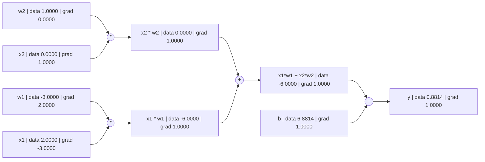

# 反向传播

## 公式和图表
$y=x_1w_1 + x_2w_2 + b$，以下的图表表示着正向传播的流程

### 输入
$x_1=2, \\ x_2=0$

### 初始权重
$w_1=-3, \\ w_2=1, \\ b=6.8814$



        w2["w2 | data 1.0000 | grad 0.0000"]
        x2["x2 | data 0.0000 | grad 0.0000"]
        w1["w1 | data -3.0000 | grad 0.0000"]
        x1["x1 | data 2.0000 | grad 0.0000"]
        b["b | data 6.8814 | grad 0.0000"]

        mul1((*))
        xw2["x2 * w2 | data 0.0000 | grad 0.0000"]

        mul2((*))
        xw1["x1 * w1 | data -6.0000 | grad 0.0000"]

        add1((+))
        sum_xw["x1*w1 + x2*w2 | data -6.0000 | grad 0.0000"]

        add2((+))
        y["y | data 0.8814 | grad 1.0000"]

    w2 --> mul1
    x2 --> mul1
    mul1 --> xw2

    w1 --> mul2
    x1 --> mul2
    mul2 --> xw1

    xw2 --> add1
    xw1 --> add1
    add1 --> sum_xw

    sum_xw --> add2
    b --> add2
    add2 --> y


正向传播后，我们就要开始反向传播了
<!-- more -->

# 计算全部的导数

## 第一层
### b的导数
\begin{eqnarray\*}
 y &=& -6+b \\\\
 \frac{dy}{db}  &=& 1 \\\\
\end{eqnarray\*}
  

### $(x_1w_1 + x_2w_2)$的导数
\begin{eqnarray\*}
 y &=& (x_1w_1 + x_2w_2)+6.8814 \\\\
 \frac{dy}{d(x_1w_1 + x_2w_2)}  &=& 1 \\\\
\end{eqnarray\*}
  

## 第二层
### $x_1w_1$的导数
\begin{eqnarray\*}
 (x_1w_1 + x_2w_2) &=& x_1w_1+0 \\\\
 \frac{d(x_1w_1 + x_2w_2)}{d(x_1w_1)}  &=& 1 \\\\
\end{eqnarray\*}
 
通过链式法则
\begin{eqnarray\*}
 \frac{dy}{d(x_1w_1)} &=& \frac{dy}{d(x_1w_1 + x_2w_2)} \cdot \frac{d(x_1w_1 + x_2w_2)}{d(x_1w_1)} \\\\
   &=& 1 \cdot 1 \\\\
   &=&  1
\end{eqnarray\*}
  

### $x_2w_2$的导数
\begin{eqnarray\*}
 (x_1w_1 + x_2w_2) &=& -6 + x_2w_2 \\\\
  \frac{d(x_1w_1 + x_2w_2)}{d(x_2w_2)} &=& 1  \\\\
\end{eqnarray\*}
 

通过链式法则
\begin{eqnarray\*}
 \frac{dy}{d(x_2w_2)} &=& \frac{dy}{d(x_1w_1 + x_2w_2)} \cdot \frac{d(x_1w_1 + x_2w_2)}{d(x_2w_2)} \\\\
   &=& 1 \cdot 1 \\\\
   &=&  1
\end{eqnarray\*}
  

## 第三层

### $x_1$的导数
\begin{eqnarray\*}
 x_1w_1 &=& x_1 \cdot w_1 \\\\
   &=& -3x_1 \\\\ 
  \frac{dx_1w_1}{dx_1}  &=& -3 \\\\
\end{eqnarray\*}
 

通过链式法则
\begin{eqnarray\*}
 \\frac{dy}{d(x_1)} &=& \frac{dy}{d(x_1w_1)} \cdot \frac{d(dx_1w_1)}{d(dx_1)} \\\\
   &=& 1 \cdot -3 \\\\
   &=&  -3
\end{eqnarray\*}
  

### $w_1$的导数
\begin{eqnarray\*}
 x_1w_1 &=& x_1 \cdot w_1 \\\\
   &=& 2w_1 \\\\ 
  \frac{dx_1w_1}{dw_1}  &=& 2 \\\\
\end{eqnarray\*}
 
通过链式法则
\begin{eqnarray\*}
 \frac{dy}{d(w_1)} &=& \frac{dy}{d(x_1w_1)} \cdot \frac{d(x_1w_1)}{d(dw_1)} \\\\
   &=& 1 \cdot 2 \\\\
   &=&  2
\end{eqnarray\*}
  

### $x_2$的导数
\begin{eqnarray\*}
 x_2w_2 &=& x_2 \cdot w_2 \\\\
   &=& 1x_2 \\\\ 
 \frac{dx_2w_2}{dx_2}  &=& 1 \\\\
\end{eqnarray\*}
 
通过链式法则
\begin{eqnarray\*}
 \frac{dy}{d(dx_2)} &=& \frac{dy}{d(x_2w_2)} \cdot \frac{d(dx_2w_2)}{d(dx_2)} \\\\
   &=& 1 \cdot 1 \\\\
   &=& 1
\end{eqnarray\*}
  

### $w_2$的导数
\begin{eqnarray\*}
 x_2w_2 &=& x_2 \cdot w_2 \\\\
   &=& 0(w_2) \\\\ 
 \frac{dx_2w_2}{dw_2}  &=& 0 \\\\
\end{eqnarray\*}
 
通过链式法则
\begin{eqnarray\*}
 \frac{dy}{d(dw_2)} &=& \frac{dy}{d(x_2w_2)} \cdot \frac{d(dx_2w_2)}{d(dw_2)} \\\\
   &=& 1 \cdot 0 \\\\
   &=& 0
\end{eqnarray\*}
  

# 最终图表

# 结论
反向传播其实是寻找每个权重$(w,b)$的y导数$\frac{dy}{d<权重>}$。 这样我们就能知道每个权重如果增加/减少会对y（输出）产生什么作用，以便我们知道该如何调整权重。通常来说，我们会算的都不会是y（输出），而是loss（损失）。以下是使用MSE公式来计算loss。
$$MSE = \frac{1}{n} \sum_{i=1}^{n} (y_i - \hat{y}_i)^2$$

所以其实我们会算的其实是loss导数$\frac{dLoss}{d<权重>}$，来寻找每个权重的变化会对loss造成的影响从而调整权重来减少loss。

